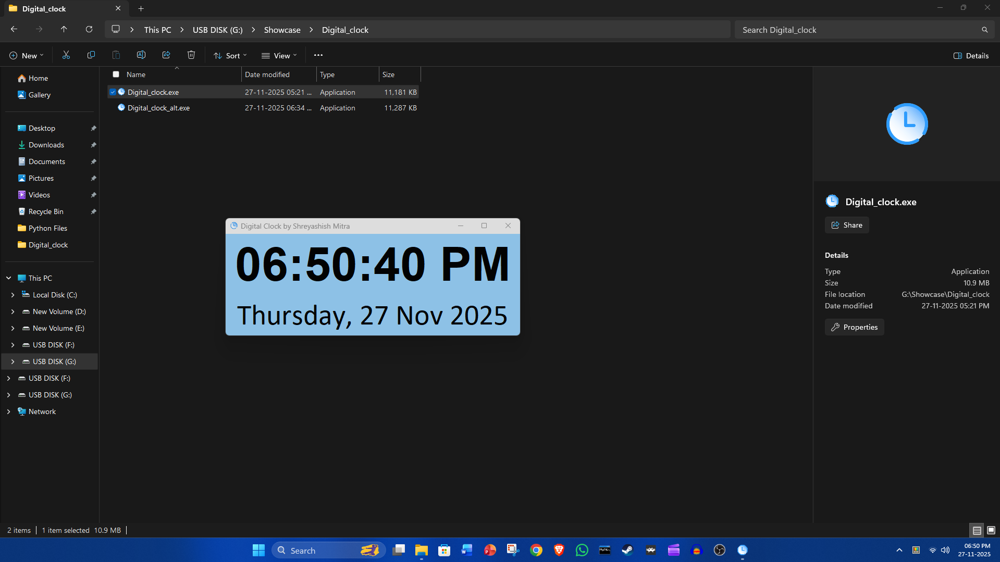
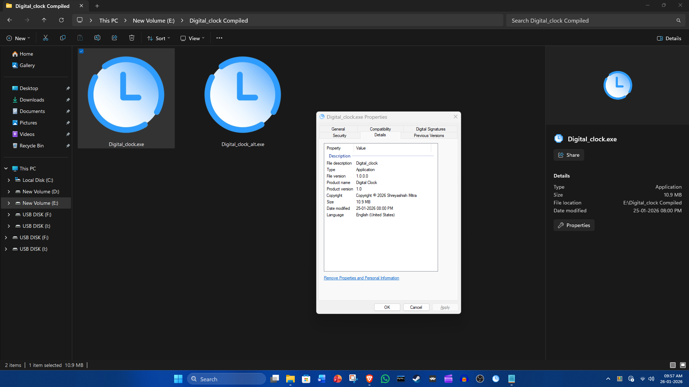
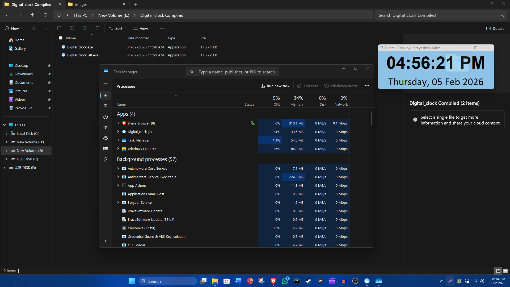

# Digital Clock

A lightweight desktop app that displays the **current time and date in real time** with a clean, minimal, translucent interface. This is made using python, libraries used in this app are tkinter, datetime, time and ctypes

---

## ✨ Features

* 🕒 **Real-time digital clock** (updates every second)
* 📅 **Full date display** (Day, Date, Month, Year)
* 🪟 **Always-on-top window** for easy visibility
* 🎨 **Clean and minimal UI** with large readable text, translucent design
* ⚡ **Lightweight & fast** standalone executable
* 🖥️ **No installation required** – just run the `.exe` file, the program may show a security warning the first time you run it. If this happens, click on More info -> Run anyway.

---

## 📂 Files Included

* `Digital_clock.exe` – Main application
* `Digital_clock_alt.exe` – Alternate build for 4k monitor/screen

Both files are portable and can be run directly **only on Windows. As this is a Windows build only works for windows 10 and 11**

---

## 🚀 How to Use

1. Open the folder containing `Digital_clock.exe` \ `Digital_clock_alt.exe`
2. Double-click the file to launch the clock
3. Drag the window anywhere on your screen
4. Keep it running in the background while you work, study, or watch videos
5. Addition you can pin it in the desktop, taskbar or at start menu

No setup or configuration is required.

---

## 🎯 Use Cases

* Desktop time reference
* Studying or exam preparation
* Presentations or screen recordings
* Secondary monitor clock
* Minimal desk setup aesthetic
* For improving your time management

---

## 📸 Preview

Here is a quick perview.

---

Thank you for checking out this project!
