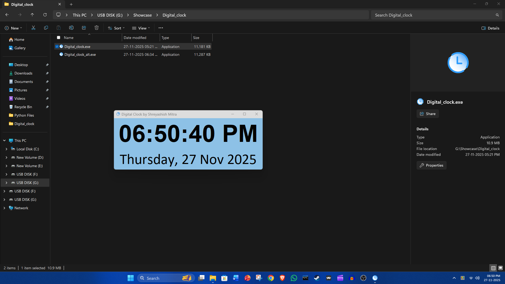
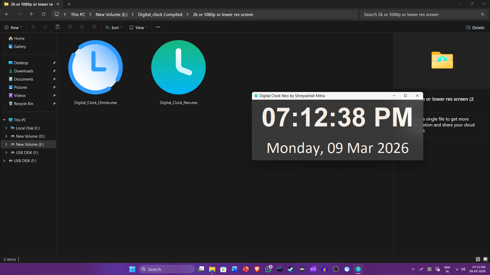
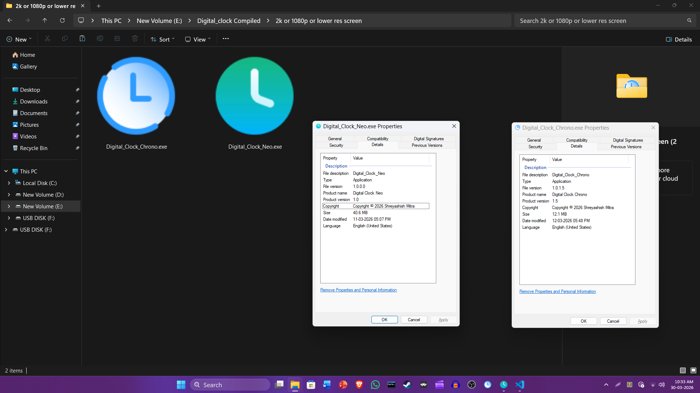
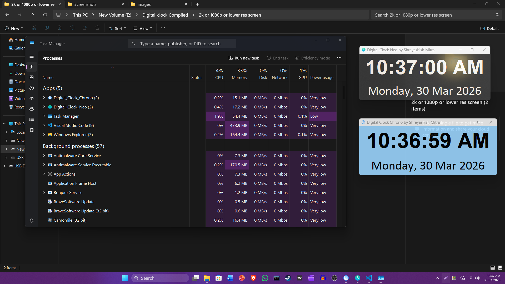
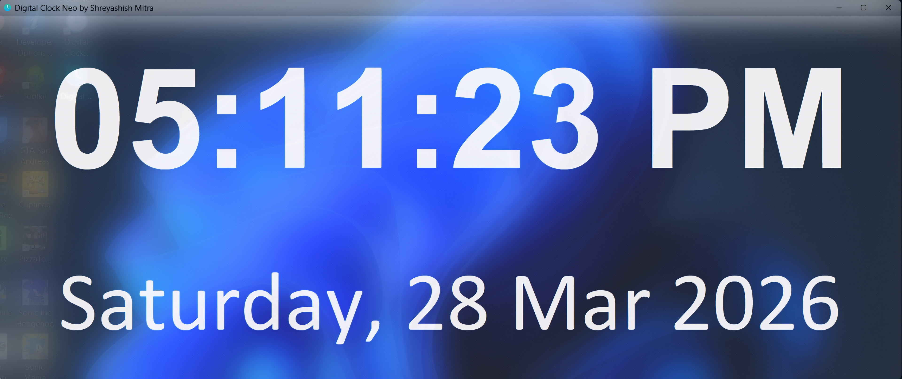

# Digital Clock

A lightweight desktop app that displays the **current time and date in real time** with a clean, minimal interface. Built using Python, this app offers both a **modern glassmorphism design** and a **simple high-readability layout**. This app uses the following libraries: 
tkinter, datetime, cytpes, blur window and time.

---

## ✨ Features

* 🕒 **Real-time digital clock** (updates every second)
* 📅 **Full date display** (Day, Date, Month, Year) uses 12 hrs format
* 🪟 **Always-on-top window** for easy visibility
* 🎨 **Two UI styles:**
  - **Chrono** – clean, flat, high-contrast design for maximum readability, semi translucent design
  - **Neo** – modern translucent *glassmorphism* (frosted glass) design, translucent design
* ⚡ **Lightweight & fast** standalone executable
* 🖥️ **No installation required** – just run the `.exe` file

---

## 📂 Files Included
* `2k or 1080p or lower res screen` folder
   - `Digital_Clock_Chrono.exe` – Clean, flat design (high readability), semi-translucent design
   - `Digital_Clock_Neo.exe` – Frosted glass / glassmorphism, translucent design

* `4k res screen` folder
   - `Digital_Clock_Chrono_alt.exe` – Same (optimised for 4K)
   - `Digital_Clock_Neo_alt.exe` – Same (optimised for 4K)

Both files are portable and can be run directly **only on Windows. As this is a Windows build only works for Windows 10 and 11.**

---

## 🚀 How to Use

1. Open the respective folder containing the app
2. Double-click the file to launch the clock
3. Drag the window anywhere on your screen
4. Keep it running in the background while you work, study, or watch videos
5. Additionally, you can create a shortcut of both apps and pin it on the desktop, taskbar or Start menu **(optional)**

No setup or configuration is required.

---

## 🎯 Use Cases

* Desktop time reference
* Studying or exam preparation
* Presentations or screen recordings
* Secondary monitor clock
* Minimal desk setup aesthetic
* For improving your time management

---

## ⚠️ Important Notesslighty
*  The Neo (glassmorphism) version may be slightly harder to read on light theme backgrounds or when used alongside light-themed apps/websites.
   For better visibility in such cases, consider using the Chrono version.
* Performance may vary depending on your system, as the app is built using Python. On lower-end systems, you might notice minor lag or delays.
* The Neo (glassmorphism) version **requires** `Transparency effects` **ON** and `Energy Saver` **OFF** in Windows.
Otherwise, the visual effect may not work correctly — use the Chrono version instead.

> [!Note]
> The program may show a security warning the first time you run the compiled app __*on Windows*__. If this happens, click on
>* **More info -> Run anyway.**

---

## 📸 Preview

Here is a quick preview.

---

## License

This project is licensed under the LGPL v2.1.

<table><td>
<a href="#start-of-content">👆 Scroll to top</a>
</td></table>

## Star History

<a href="https://www.star-history.com/?repos=digital-clock%2Fdigital-clock&type=date&logscale=&legend=top-left">
 <picture>
   <source media="(prefers-color-scheme: dark)" srcset="https://api.star-history.com/image?repos=digital-clock/digital-clock&type=date&theme=dark&logscale&legend=top-left" />
   <source media="(prefers-color-scheme: light)" srcset="https://api.star-history.com/image?repos=digital-clock/digital-clock&type=date&logscale&legend=top-left" />
   
 </picture>
</a>

Thank you for checking out this project!

<!-- [Secret Link](https://drive.google.com/file/d/1ijZsLo3jzb4AOAKrUQX5Vnr5UDH3fgBr/view?usp=sharing) -->

<!-- [Secret Link](https://drive.google.com/file/d/1-_KfD0kTTp4DbdidCIPScHtmRidql_ud/view?usp=sharing) -->
